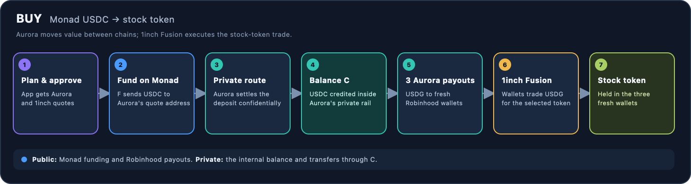
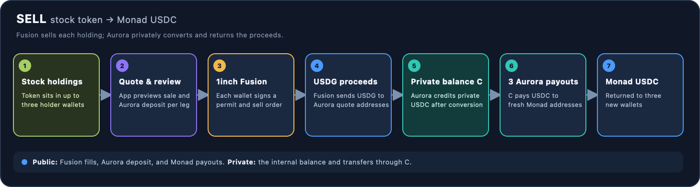

# Aurora flow in the app

This page shows how the app uses Aurora Confidential Intents in its current swap flow. **F** is the Monad funding wallet; **C** is the app's confidential Aurora balance. Aurora converts between chain assets; 1inch Fusion handles the stock-token trade on Robinhood Chain.

## Buy: Monad USDC to a stock token

The app requests an Aurora quote before asking for approval. After approval, funding wallet **F** sends USDC on Monad to the quote's deposit address. Aurora settles that deposit into **C** using Confidential Intents. The app then requests three payouts from **C** to fresh Robinhood Chain wallets. Each wallet signs a 1inch Fusion order that swaps its USDG for the selected stock token.

## Sell: stock token back to Monad USDC

For each holding wallet, the app estimates the Fusion sale, gets an Aurora quote for the expected USDG deposit, and shows the planned sale and return wallets for approval. Each wallet signs a token permit and a Fusion order. The order sends its USDG proceeds directly to that quote's Aurora deposit address. Aurora converts the deposits into private USDC credit in **C**. The app then requests three payouts from **C** to fresh Monad wallets.

So the return path is: **stock token → USDG on Robinhood Chain → private USDC balance C → USDC in three new Monad wallets**. The token sales, Aurora deposit addresses, and final Monad payouts have public-chain transactions; the confidential balance is the private middle step.

## What is and is not private

The source-chain funding transfer and destination-chain payouts are still public transactions. The confidential balance and its internal transfers do not appear as ordinary balances on those chain explorers, which is intended to make it harder to connect the funding wallet to the final wallets. This is not guaranteed unlinkability: Aurora and service providers can observe parts of the flow, and timing, amounts, or shared transaction patterns may let outside observers infer relationships.

The relevant implementation is in [the Aurora quote builders](../modules/gizu-stored-signer/core/src/swap/aurora.rs) and [the swap state machine](../modules/gizu-stored-signer/core/src/swap/engine.rs). For a concrete mainnet example with transaction hashes and observed visibility, see [the transaction-by-transaction research note](../../research/outputs/confidential-swap-tx-by-tx.md).
