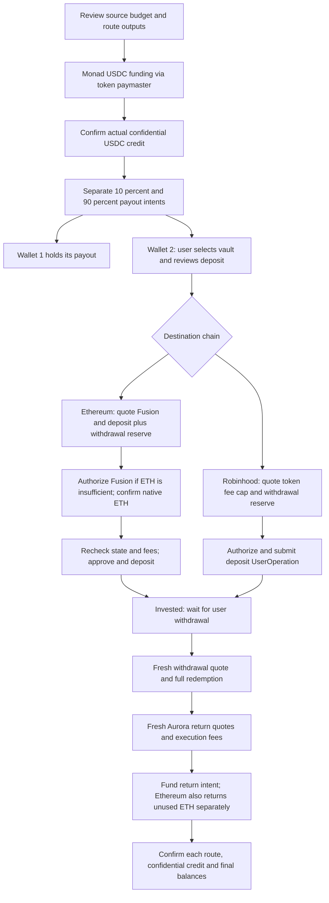

# Confidential Earn: app integration handover

Prepared 30 September 2026. Mainnet evidence below is from 29 September 2026 UTC. This document describes the accepted design, observed implementation, and remaining production work. **It does not authorize another mainnet transaction.**

Start implementation with [APP-INTEGRATION-TASK.md](APP-INTEGRATION-TASK.md). Use this document for product/fee policy and [MAINNET-TEST.md](MAINNET-TEST.md) for historical execution evidence. Earlier Circle experiments, 20/80 splits, unfilled Fusion attempts, and incomplete-cycle reports in other documents are historical; they do not supersede the completed results below. Code references describe the research runner at handover time, not a production-ready mobile integration.

## 1. Objective and non-negotiable decisions

The objective is to invest the amount remaining after properly budgeting execution, then return funds to Aurora's confidential account without accumulating significant destination-wallet dust. It is **not** to obtain an artificially small reserve by bidding below viable fees or understating gas limits.

- Final combined spendable remainder in the participating investment wallet must be **strictly below 0.5 USDC equivalent**; **strictly below 0.1** is optimal. Exactly 0.5 fails; exactly 0.1 is acceptable but not optimal.
- Check after withdrawal and all return legs settle. Shares must be zero for a full exit; WETH must be explicitly reconciled, not silently omitted. A receipt alone is not completion.
- Wallet 1's intentional payout is not dust from wallet 2's investment cycle. Do not sweep wallet 1 to make wallet 2 pass.
- Use dynamically simulated gas and live quotes, with explicit percentage buffers. Never encode the historical dollar amounts as fixed fees.
- Ethereum: **Fusion USDC → native ETH before deposit; native transactions afterward.** No Circle paymaster or destination bundler in this path.
- Robinhood: **USDG token paymaster + bundler** for deposit, withdrawal, and Aurora funding. The tested provider is Pimlico.
- Source: Monad USDC, with Pimlico's USDC paymaster. Split the **confirmed confidential input** 10/90 before separate payout-route fees; only wallet 2 invests.
- Deposit starts when the user selects the vault and approves deposit. The test's immediate full redemption is not app behavior. Withdrawal is a later, separate user action.
- No new helper contract, wallet-to-wallet transfer, transaction containing both destination wallets, shared application fee collector, or application/sponsorship fee charged before confidential routing. Established provider contracts and their provider fees are permitted.
- Prefer Candide where supported and verified. It was not supported by the tested endpoints for Monad/Robinhood; do not replace Pimlico on name preference alone.

The test's 70/30 allocation between Ethereum/Robinhood, up-to-10-USDC source budget, shared destination addresses across those chains, existing funded source, and automatic local test lifecycle are **test configuration**, not production defaults. The current 10/90 split is the latest accepted experiment setting; expose/version future product allocation decisions explicitly.

## 2. Supported profiles and proof boundaries

| Role | Chain | Asset / vault | Execution |
| --- | --- | --- | --- |
| Source | Monad, 143 | Monad USDC, validated from route metadata | Pimlico token paymaster, ERC-4337 / EIP-7702 |
| Investment | Ethereum, 1 | USDC `0xA0b86991c6218b36c1d19D4a2e9Eb0cE3606eB48`; Pendle Ecosystem vault `0x55C1B6e461a6334B567bAF0FEb5D728715446f05` | Fusion bootstrap; native approval/deposit/redemption/returns |
| Investment | Robinhood, 4663 | USDG `0x5fc5360D0400a0Fd4f2af552ADD042D716F1d168`; Steakhouse vault `0xBeEff033F34C046626B8D0A041844C5d1A5409dd` | Pimlico token paymaster; EntryPoint v0.8 |
| Future | Base / other chains | No completed equivalent profile in this handover | Separate provider, asset, vault, charging and lifecycle qualification required |

Both destination tokens use six decimal places; native ETH uses 18. Do not generalize those decimals to arbitrary tokens or assume vault shares use the underlying token's decimals. Verify chain ID, code/delegation, vault `asset()`, token decimals, owner, spender and route assets before signing. [Profile source](src/routes.mjs).

### Completed Ethereum cycle

| Item | Observed amount |
| --- | ---: |
| Wallet 2 USDC before Fusion | 6.256264 USDC |
| Existing vault shares carried into cycle | 0.133013839453606864 shares |
| USDC sold through Fusion | 5.121694 USDC |
| Native ETH received | 0.001133295335295891 ETH |
| New vault deposit | 1.084570 USDC |
| Temporarily retained while invested | 0.050000 USDC |
| Full redemption, including old shares | 1.218730 USDC |
| USDC sent to Aurora | 1.268730 USDC |
| Native ETH sent to Aurora | 0.000678997020223204 ETH |
| Actual owner-paid native gas, six transactions | 0.000454298315072687 ETH |
| Authenticated confidential USDC credited by both returns | 3.081997 USDC |
| Final wallet 2 | **0 ETH / 0 USDC / 0 WETH / 0 shares** |

The ETH identity is exact: received ETH − owner-paid native gas = returned ETH. The 0.05 USDC was returned, not abandoned. Redemption includes a pre-existing position: do not infer investment yield or cycle profit from these totals. The 3.081997 credit is in **Aurora's confidential Monad-USDC asset**, not a public transfer to the source address.

Native gas receipts, in execution order:

| Operation | Gas used | Actual total price, gwei | ETH paid |
| --- | ---: | ---: | ---: |
| Deposit approval | 55,558 | 0.554251195 | 0.000030793087891810 |
| Deposit | 310,897 | 0.568337347 | 0.000176694376170259 |
| Withdrawal approval | 45,984 | 0.560101169 | 0.000025755692155296 |
| Withdrawal | 294,383 | 0.584317390 | 0.000172013106220370 |
| USDC return funding | 57,448 | 0.589523299 | 0.000033866934480952 |
| ETH return funding | 21,000 | 0.722624674 | 0.000015175118154000 |

Fusion resolver gas is embedded in the exchange terms; it is **not** part of that owner-paid native-gas total. The resolver's whole transaction used 373,418 gas at 0.640090638 gwei. Its quoted estimate was 587,612 gas before headroom. This proves a public resolver filled these terms, not that the compensation was minimal.

After Fusion filled, a higher fee quote temporarily blocked deposit. The runner waited; it did not lower the reserve. Later fees allowed the original ETH purchase to cover the entire cycle. No second ETH purchase, reverted native transaction, or replacement was needed. Wallet 1 was unchanged: 1.125870 USDC and 0.000030933 ETH at the comparison blocks.

Evidence: [independent receipts, balances and credit](fixtures/ethereum-mainnet-cycle.json), [Fusion fill](fixtures/ethereum-fusion-mainnet-fill.json), [funding/payout history](fixtures/ethereum-mainnet-progress.json), [transaction links and chronology](MAINNET-TEST.md).

### Completed Robinhood cycle

| Item | Observed amount |
| --- | ---: |
| Wallet 2 payout | 2.773924 USDG |
| New vault deposit / redemption | 2.521136 USDG |
| Deposit fee budget / signed cap / actual fee | 0.077438 / 0.073750 / 0.042774 USDG |
| Withdrawal reserve at deposit | 0.175350 USDG |
| Withdrawal signed cap / actual fee | 0.059697 / 0.025875 USDG |
| Return sent to Aurora | 2.650000 USDG |
| Return signed cap / actual fee | 0.025334 / 0.011068 USDG |
| Total actual destination paymaster charges | 0.079717 USDG |
| Confidential USDC credited | 2.636109 USDC |
| Final wallet 2 | **0.044207 USDG / 0 ETH / 0 shares** |

Exact reconciliation: 2.773924 − 0.079717 − 2.650000 = 0.044207 USDG. Its recorded fresh valuation was approximately 0.044211 USDC, below the optimal threshold. These token paymaster transfers showed actual charges; do not describe them as Circle pulling the full cap then refunding it.

Aurora temporarily stopped offering a fresh USDG quote. The run used an earlier accepted, **unexpired and unfunded** 2.65-USDG quote, validated again with fresh paymaster fees. It did not find a different asset route. A funded/completed intent is never reusable. Evidence: [receipt accounting](fixtures/robinhood-mainnet-receipts.json), [final balances](fixtures/mainnet-final-balances.json), [mainnet narrative](MAINNET-TEST.md).

Both mainnet successes are single-cycle evidence. Future fees, vault liquidity, resolver admission and return-route availability remain variable. The recorded regression suite had 118 passing tests before the completed Ethereum run; that is historical evidence, not a claim that app tests exist or ran for this handover.

## 3. Full product flow and fee ledger



Separate funding, payout, investment, withdrawal and return records. A single “transaction fee” field cannot represent this flow.

| Component | Charge / reservation mechanism | Display rule |
| --- | --- | --- |
| Source gas | USDC paid through source paymaster | Show cap before authorization; actual receipt charge afterward |
| Source Aurora route | Difference between funded input and confirmed private output, with provider quote breakdown where available | Show quoted minimum and actual credit; do not call the whole difference gas |
| Two payouts | Independently quoted route fees / conversion and minimum outputs | Show each net output; 10/90 input allocation is not a promise of 10/90 net outputs |
| Ethereum Fusion | USDC sold for net native ETH; provider costs and resolver allowance embedded | Show input, minimum net ETH, price basis, embedded cost estimate; do not charge allowance twice |
| Ethereum native execution | Actual gas used × effective gas price | Separate deposit estimate, withdrawal reserve, and later return estimate |
| Robinhood execution | USDG charge bounded by the supported signed paymaster terms | Separate actual cost, signed cap and extra budget; unused budget stays in wallet |
| Vault | Shares/assets at current conversion, slippage protection and applicable vault economics | Read actual vault configuration; do not invent a zero-fee or fixed-yield claim |
| Aurora returns | Origin transfer gas plus each route's quoted net output | Quote after withdrawal; final credit may differ from input value |
| Application fee | None in the accepted experiment | Do not introduce a fee recipient or source application fee |

Split atomically in integer accounting: `wallet1Input = floor(confirmedPrivateAtoms / 10)`; `wallet2Input = confirmedPrivateAtoms - wallet1Input`. Sign independent destination intents. Initial quoted private output does not replace the actual credited balance.

### Source funding and route-price accounting

The research source runner first estimates a token-sponsored transfer, then quotes Aurora for `sourceBudget - estimatedPaymasterCap - sourcePadding`. It re-estimates the exact quoted deposit-address transfer and retries up to four times if the fee no longer fits. The current source padding is **10,000 USDC atoms = 0.01 USDC**; this is an additional research funding margin, not an application charge or a replacement for measured gas. At signing, the exact operation cap must fit `sourceBudget - transferAmount`. Source `.standard` Pimlico pricing is separate from the Robinhood destination's 10% fee-price buffer. [Funding orchestration](src/runner.mjs), [source fee helper](src/source-paymaster.mjs).

For the Ethereum test, the source transfer was 7.640235 Monad USDC and the actual source paymaster charge was 0.001646 USDC. Aurora credited 7.637178 confidential USDC. Its 10/90 inputs were 0.763717 and 6.873461 USDC; net Ethereum payouts were 0.161805 and 6.256264 USDC. Those differences illustrate why the app must show **net route outputs**, particularly for a small 10% leg. They are not fixed route fees, and the difference on a cross-asset route cannot be called a token-denominated fee without a price basis. [Source and payout evidence](fixtures/ethereum-mainnet-progress.json).

The residual acceptance target concerns the investment destination wallet after return, not a claim that the experiment drains its public source wallet or the intentional wallet-1 allocation. Define any future source cleanup separately; do not silently spend retained source funds to rescue an exit.

Record currency and units on every amount. ETH is an amount; gwei is a **price per gas unit**. `feeETH = gasUsed × effectiveGasPriceWei / 10^18`. Distinguish base fee, priority fee, signed maximum fee, and actual inclusion price. Gas units are neither gwei nor ETH.

## 4. Ethereum fee calculations

Sources: [fee sampling, planner and user summary](src/native-planner.mjs), [EIP-1559 arithmetic](src/ethereum-fee.mjs), [provider adapter](src/native-providers.mjs), [native budgets](src/native-gas.mjs), [simulation](src/native-simulation.mjs), [vault calls](src/native-vault.mjs), [freshness/reconciliation](src/native-context.mjs).

### 4.1 Inclusion policy: full 25th-percentile sample

1. Read the current block and `eth_feeHistory` for eight blocks ending at that block, requesting reward percentile **25**.
2. Each returned reward is the gas-weighted 25th-percentile included priority fee for that block. Sort the eight samples and select index `floor(8 / 2) = 4`: the upper middle sample. Do not silently replace it with the average of the middle two.
3. Use multiplier **1**, not the earlier proposed 2/3. Apply the current minimum of 10,000 wei = 0.00001 gwei.
4. Calculate the exact next-block EIP-1559 base fee from current base fee, gas used and target gas. Add one further worst-case base-fee increase for the two-block budgeting horizon.
5. `depositMaxFee = bufferedBaseFee + sampledPriorityFee`.
6. `withdrawalReserveFee = ceil(depositMaxFee × 2)`.

The percentile is an inclusion bidding policy, **not a network-required minimum and not an inclusion guarantee**. The earlier 40th-percentile 1-gwei result was independently reproduced from receipts; the mistake was treating the chosen policy as necessary inclusion cost, not an arithmetic impossibility. Eight-block samples can change materially over time. Record block/time with any displayed gwei comparison. [Receipt audit](fixtures/ethereum-fee-history-audit.json).

### 4.2 Simulated native gas and ETH funding

Simulate the exact approval(s), deposit, and full withdrawal from the post-deposit state, including old shares when authorized. Existing allowances can change the required transaction list; never hardcode six transactions for every user.

```text
depositGasLimit[i]    = ceil(simulatedDepositGas[i] × 1.10)
withdrawalGasLimit[i] = ceil(simulatedWithdrawalGas[i] × 1.30)
D = sum(depositGasLimit) × depositMaxFee
W = sum(withdrawalGasLimit) × withdrawalReserveFee
N = D + W                              # wei to budget for deposit + withdrawal
ethShortfall = max(N - existingNativeETH, 0)
depositUSDC = currentUSDC - fusionInputUSDC - 50,000 atoms
```

The temporary 50,000 atoms = **0.05 USDC** is a liquid threshold, not a gas forecast and not the final residual allowance. The 2× withdrawal price buffer is a finite reserve; it cannot insure arbitrary future gas prices or withdrawal liquidity months later.

If existing native ETH covers the budget, skip Fusion. Otherwise select a real quote whose **minimum net native ETH** covers the shortfall. Re-simulate after reducing the deposit by the USDC purchase amount; repeat until affordable and stable. The runner caps quote sizing at eight attempts and the outer deposit simulation at five. It fails if it cannot converge; it does not weaken the cap to force success.

Vault calls use share-price protection and a deadline. Current Ethereum defaults include 10-bps share-price tolerance and a 600-second deadline; validate the exact SDK-built calls and semantics when porting. These are separate from Aurora slippage and Fusion quote headroom.

### 4.3 Fusion resolver economics — part of the fee equation

An executable order is not necessarily profitable for a public resolver. The two earlier unfilled orders and the successful replacement demonstrated this distinction.

Current model, using integer wei and provider prices:

```text
V = floor(inputUSDCAtoms × usdcUsdPrice18 × 10^12 / ethUsdPrice18)
rawGas = max(provider.gas, provider.gasLimit, 202,859, carriedPreviewGasFloor)
G = ceil(rawGas × 1.20)
P = ceil(depositMaxFee × 1.25)
C = G × P
M = ceil(C × 0.10)
resolverAllowance = C + M
maximumGrossETH = V - resolverAllowance
customAuctionAmount = floor(maximumGrossETH × 9950 / (10000 + protocolFeeBps)) - 2 wei
```

Require positive provider estimates. The 202,859-gas floor comes from the recorded direct-fill replay; it is not a complete universal resolver route estimate. Prefer the larger provider estimate and carry a larger preview estimate into final preparation. The 20% gas headroom, 25% fee headroom, 10% execution-profit allowance, 0.5% price headroom, and two-wei rounding allowance are the **current research policy**, not amounts mandated by 1inch.

The custom auction is flat for 180 seconds, has no curve points, and forbids partial/multiple fills. Revalidate the actual returned curve, protocol fee, token prices and resolver whitelist. Calculate gross resolver payment and minimum **net user receive** across eligible resolvers using the pinned SDK. Require modeled profit `V - grossETH - G×P >= M`. Missing data or changed economics means re-plan, not assume zero cost.

Preview quotes are unsigned. Final preparation requires the provider's estimated quote, a valid quote ID, EIP-2612 permit and Fusion order authorization. Validate token, chain/domain, owner, nonce, spender, receiver, full input, native unwrap, deadline and minimum output. Persist the exact approved order before submitting. **WETH is not spendable ETH for native gas.**

Current SDK: `@1inch/fusion-sdk` 2.4.15; Morpho SDK 6.0.0. Revalidate provider contracts/APIs when upgrading. Sources: [Fusion model](src/fusion-bootstrap.mjs), [submission adapter](src/native-providers.mjs), [local economics evidence](fixtures/fusion-economics-lab.json), [actual public fill](fixtures/ethereum-fusion-mainnet-fill.json).

Do not show “guaranteed fill” or a universal profitable-gwei threshold. Break-even gwei belongs to one order, its price assumptions and gas model. Resolver capital, route choices, provider eligibility and later prices can still prevent a fill. The successful conservative allowance has not been optimized to minimum cost.

### 4.4 Cost display without double counting

At a consistent ETH/USDC conversion price:

```text
purchaseValueETH = USDC input expressed in ETH
fusionOverheadETH = max(purchaseValueETH - minimumNetETHReceived, 0)
depositAndWithdrawalBudgetETH = D + W
combinedBudgetETH = D + W + fusionOverheadETH
extraFundingETH = max(existingETH + purchasedETH - (D + W), 0)
```

`fusionOverheadETH` already includes the quoted exchange friction, resolver execution/profit allowance, protocol fee and price headroom. **Do not add `resolverAllowance` again.** Existing ETH reduces how much USDC must be sold; it does not eliminate gas consumption. Additional usable ETH is an asset, not a fee already paid.

Display both the wallet allocation and the economic budget. They answer different questions:

- Wallet allocation: `initialUSDC = Fusion input + vault deposit + liquid USDC`.
- Budget: estimated deposit gas + reserved withdrawal gas + quoted Fusion overhead. Unused ETH can be returned.
- Return costs: excluded from this pre-deposit budget; obtain current eligibility/indicative quotes, disclose the exclusion, and calculate executable costs again after withdrawal.

**Historical preview, not the executed quote:** [20:43 UTC preview](fixtures/ethereum-total-cost-preview.json).

| Field | Value |
| --- | ---: |
| Initial USDC | 6.256264 |
| Deposit maximum / priority / withdrawal reserve, gwei | 0.629874562 / 0.041829255 / 1.259749124 |
| Deposit gas budget, ETH | 0.000301772272779638 |
| Withdrawal reserve, ETH | 0.000600917968635736 |
| Quoted Fusion overhead, ETH equivalent | 0.000405692668024358 |
| Combined budget | 0.001308382909439732 ETH equivalent ≈ 3.519848 USDC |
| USDC used to purchase ETH | 3.546219 |
| Minimum ETH received | 0.000912492940932017 |
| Additional funding headroom, ETH | 0.000009802699516643 |
| Vault deposit / liquid USDC | 2.660045 / 0.050000 |

The later execution invested only 1.084570 USDC because live quotes changed. **The app must not silently replace a user-approved 2.660045 deposit with 1.084570.** Bind approval to maximum spend, minimum ETH, minimum deposit, fee bounds and validity. Any plan outside those approved bounds requires a new review.

The research summary currently approximates USDC value from an ETH/USD feed, whereas the Fusion model uses both token prices. Production must use a consistent ETH/USD divided by USDC/USD basis, with timestamps and conservative rounding. Do not assume either USDC or USDG is always exactly one dollar.

## 5. Robinhood paymaster budgets and residuals

Sources: [fee policy](src/token-earn-policy.mjs), [live planning](src/robinhood-cli.mjs), [paymaster adapter](src/robinhood-paymaster.mjs), [engine](src/token-earn-engine.mjs).

The tested paymaster is `0x888888888888Ec68A58AB8094Cc1AD20Ba3D2402`. Validate deployment, supported mode/flags, token and current charging semantics; the research decoder requires at least 182 bytes and rejects optional constant-fee, prefunding and recipient extensions.

```text
G = preVerificationGas + callGasLimit + verificationGasLimit
    + paymasterPostOpGasLimit + paymasterVerificationGasLimit
signedTokenCap = ceil((G + providerPostOpTerm) × maxFeePerGas × tokenRate / 10^18)
operationBudget = ceil(estimatedTokenCap × 1.05)
withdrawalReserve = ceil(postDepositWithdrawalEstimateCap × 2.60)
depositAmount = currentUSDG - depositOperationBudget - withdrawalReserve
```

The extra post-operation term and rate are decoded from provider paymaster data. Do not remove or double-add that term based on its name; preserve the tested contract accounting. Both `.standard` Pimlico fee fields are buffered by 10% for this Robinhood profile. Final sponsorship cannot exceed the approved operation budget; a provider must not silently change token, fees, calls or price assumptions.

The future withdrawal estimate uses the post-deposit fork state with a stub paymaster. It is not a reservation of future public sponsorship. At withdrawal, obtain fresh real sponsorship and check actual liquid USDG. If insufficient, pause before signing. Do not promise the 2.6× reserve always covers a long holding period.

For return, iteratively quote an Aurora input that leaves enough for fresh operation fees. Value the **entire amount left before the actual fee is known**, plus any native ETH, as the conservative residual bound. Require it below 0.5 USDC equivalent; report whether it is below 0.1. Then independently value actual remaining assets after settlement.

In the successful run, the selected return quote left 0.055275 USDG before paying the 0.011068 actual fee; residual was 0.044207. This is not a fixed threshold to reuse. The signed return cap was 0.025334, and its additional 5% planning budget was 0.026601; the older valid route amount left more than that budget.

New Robinhood cycles currently require zero native ETH and no existing shares. Unexpected ETH later does not prevent withdrawal but must count toward final residual. There is no implemented general Robinhood native-ETH cleanup path. Fresh EIP-7702 authorization was tested locally; the already-delegated mainnet wallet does not prove public cold-wallet authorization admission.

## 6. Withdrawal and return: preserving access and closing the cycle

### Ethereum

1. On user withdrawal, read live shares, allowances, vault liquidity and fees. Simulate full redemption, including any explicitly approved old shares. Check actual ETH funding before approval and redemption.
2. After confirmation, reconcile redeemed assets and require zero shares for a full-exit cycle.
3. Quote an `advanced`, exact-input Aurora USDC return for current USDC, with refund to the same owner and the original confidential destination asset/account.
4. Budget the measured USDC transfer with 10% gas-limit headroom and the following ETH return. Probe ETH return eligibility before committing to a path that depends on it.
5. If ETH is insufficient after redemption, the research planner can propose another Fusion purchase from redeemed USDC, subject to the same economics and fresh return quotes. This is a **new cost-bearing action requiring approval**, not an automatic rescue. It was unnecessary in the successful mainnet run and remains a separate validation case.
6. Fund and confirm the USDC return; use the actual receipt and fresh ETH balance to size the ETH return.
7. Quote a separate native-ETH Aurora intent. Use a legacy fixed-`gasPrice` transfer only when recipient code is empty, calldata is empty and measured gas is exactly 21,000. `value = currentETH - 21,000 × gasPrice`. Confirm actual gas/price and zero balance.
8. Wait for both routes to reach success, authenticate the private credit, and check USDC/ETH/WETH/shares. Do not mark complete while one route is pending or refunded.

The exact native sweep avoids an EIP-1559 max-price reserve difference; it does not guarantee inclusion. If base fee rises above the signed fixed price, wait or prepare an approved same-nonce replacement and re-quote its changed value. A changed recipient with code or changed gas estimate invalidates this sweep plan.

### Both chains

- Return quote validation binds origin/destination assets, exact amount, owner/refund address, confidential recipient, `advanced` mode, deposit address and the earliest applicable deadline. The current Aurora return request uses 100-bps slippage tolerance and rejects deposit memos. [Validator](src/aurora-return.mjs).
- No quote / amount too small / provider outage is a real blocked state. Do not transfer funds to an unquoted address or promise that an old quote will remain available.
- An older unexpired, unfunded quote may be usable only after full validation and fresh affordability checks. Never reuse a funded quote, even if its status request failed.
- Successful origin transfer, successful routing status, and actual confidential credit are separate facts. Associate credit with the operation; a global account balance increase can include unrelated activity.
- A future high gas quote can make the reserved withdrawal budget insufficient. Waiting may help but does not guarantee recovery. Present current shortfall and separately approved recovery options; no hidden cross-wallet top-up.
- Vault liquidity, limits, share price and provider availability can change independently of fees. Simulate and surface actual redemption restrictions. Do not equate a funded gas reserve with unconditional withdrawability.

## 7. User-facing review and warning requirements

Use clear units and a short primary summary with expandable detail. Never label a reserve as a charge, a quoted minimum as guaranteed settlement, or a successful deposit as a completed cycle.

### Deposit review

Recommended Ethereum wording:

> Estimated Ethereum fee budget for deposit and withdrawal, including Fusion costs: **{totalBudgetETH} ETH equivalent (≈ {totalBudgetUSDC} USDC)**. From your current destination balance of **{initialUSDC} USDC**, **{depositUSDC} USDC** can be deposited. **{fusionInputUSDC} USDC** buys at least **{minimumETHReceived} ETH**; **0.05 USDC** stays liquid. Unused ETH remains yours. Aurora return costs are quoted again after withdrawal and are not included here.

The expanded breakdown must show deposit gas estimate, withdrawal reserve, Fusion input/output and embedded overhead, existing ETH used, extra usable ETH, base/priority/max fee in gwei, quote timestamp/block, minimum vault assets/shares, slippage/deadlines and approval limits. If showing “estimated total cycle cost,” include a separately labelled indicative return estimate and its uncertainty; the current runner's `totalBudget` is **not** that full-cycle figure.

Recommended Robinhood wording:

> From **{balanceUSDG} USDG**, you can deposit **{depositUSDG} USDG**. We budget up to **{depositFeeBudgetUSDG} USDG** for this operation and retain **{withdrawalReserveUSDG} USDG** for a future withdrawal. Actual charges may be lower. Withdrawal and Aurora return fees are checked again when you exit.

For both: show the amount actually invested prominently next to the initial amount. When fees consume much of a small investment, make this visible before approval; do not hide it behind an APY display. No arbitrary “high fee” percentage has been agreed here—product may add a warning threshold, but the amounts and approval bounds are mandatory.

### Required operational messages

| Situation | Message / enabled action |
| --- | --- |
| No affordable plan | “Your balance cannot cover the current execution budget and a vault deposit.” Show shortfall, refresh/wait; disable signing |
| Quote changed outside approval | “The quote changed. Your deposit would be {new}, previously {old}.” Show changed fee/output and require review |
| Fusion pending | “ETH purchase is awaiting a resolver. Nothing has been deposited into the vault yet.” Show deadline/status |
| Fusion unknown after timeout | “Submission status is being checked.” Keep the saved order; do not offer a duplicate purchase |
| Fusion conclusively expired | “The ETH purchase expired without a fill.” Reconcile balances before offering a fresh order; source/payout fees may already have been paid |
| Fusion filled, deposit now unaffordable | “ETH was received, but current fees exceed the deposit and withdrawal budget.” Show assets and shortfall; wait/review options |
| Approval mined, deposit failed/pending | Show approval as completed and deposit state separately; resume without duplicating the approval blindly |
| Withdrawal reserve shortfall | “Current withdrawal fees exceed the available reserve by {amount}.” No signature; show current quote and recovery choices |
| Vault withdrawal unavailable | Show actual vault liquidity/limit reason separately from gas insufficiency |
| Return route unavailable | “Funds are in your destination wallet. No valid return quote is available for this amount.” Do not claim funds returned |
| One return leg pending | Show each USDC/ETH leg and the remaining wallet assets; keep cycle open |
| Refunded route | Show refund receipt and restored balance; re-plan only after reconciliation |
| Residual ≥ 0.5 | “Return settled, but {value} remains. The cycle has not met the residual target.” Preserve recovery state |
| Residual ≥ 0.1 and < 0.5 | Complete with actual remainder; label acceptable, not optimal |
| Final success | Show authenticated confidential credit, actual fees, final remainder and zero shares; distinguish this from a public source-wallet transfer |

Never say that withdrawing is “free,” that all reserved ETH has been spent, or that 25th-percentile pricing guarantees a block. Dismissing a screen or cancelling an API request cannot cancel an already submitted order/transaction.

## 8. App architecture and approval boundary

### Existing mobile entry points

Read [mobile guidance](../../mobile/AGENTS.md) and [native signer contract](../../mobile/docs/NATIVE_SIGNER.md) before implementation. Relevant current paths:

- [Investment domain](../../mobile/src/domain/investments.ts) and [service](../../mobile/src/services/investments.ts): display models/demo loading, not a live earn execution API.
- [Investment provider](../../mobile/src/features/investments/InvestmentProvider.tsx), [vault controller](../../mobile/src/features/investments/useVaultDetailController.ts), [vault screen](../../mobile/src/features/investments/VaultDetailScreen.tsx), [trade bar](../../mobile/src/features/investments/detail/TradeBar.tsx): UI integration points; current navigation is not proof of live vault support.
- [Stored signer domain](../../mobile/src/domain/wallet/storedSigner.ts), [native bridge](../../mobile/src/services/wallet/nativeBridge.ts), [stored transfers](../../mobile/src/services/wallet/storedTransfers.ts): existing native trust boundary.

`GizuStoredSigner` is the active signer. The legacy `gizu-signer` is disconnected. Current stored-signer operations cover exact transfers; do not assume arbitrary vault calldata, ERC-20 approvals, EIP-2612/Fusion, ERC-4337 or EIP-7702 authorization are already supported. Add narrowly scoped native operations with semantic validation and native approval; do not expose raw private keys or an unrestricted sign-digest bridge.

The mobile implementation must preserve backup-verified wallet readiness, native passkey authorization, encrypted persistence, request revisions and native resume/cancel policy. The research `.env` private-key signer and Node filesystem journal must never be ported into JavaScript app storage. Restore does not necessarily restore local operation history; reconcile provider and chain state before a restored wallet starts another cycle.

If the intended first implementation is web rather than mobile, confirm that scope and its signer trust boundary before coding. Frontend vault components are visual references, not evidence of a validated live signing flow.

### Recommended separation

| Layer | Responsibility |
| --- | --- |
| Domain | Integer amount types, chain profiles, fee formulas, quote validity, approval bounds, residual policy, lifecycle transitions |
| Services | Aurora/Fusion/RPC/bundler/paymaster/vault adapters, typed errors, receipt parsing, authenticated credit reconciliation |
| Simulation service | Exact public-state simulation with block/hash binding; no wallet secret or server-controlled owner signer |
| Native wallet | Semantic transaction/order validation, user authorization, signing, immutable approved payload, protected journal |
| Feature controller | Review, progress, refresh, recovery, cancellation semantics, revision checks |
| UI | Cost breakdown, investable amount, warnings and progress; no signing or provider logic |

The research simulator spawns Anvil locally. A phone cannot run that Node process. Choose and validate a production simulation adapter rather than replacing exact post-deposit withdrawal simulation with a fixed gas constant. Treat backend simulation/quotes as untrusted proposals whose critical fields are checked against native policy and chain state. Keep provider credentials off distributed client bundles where they require secrecy.

Suggested immutable proposal fields (a contract to implement, not an existing API):

```text
operationId, revision, policyVersion, profileId, chainId, owner, vault, assets
referenceBlockNumber, referenceBlockHash, quotedAt, expiresAt, priceSources
startingBalances, startingShares, allowances, accountDelegation, nonce
sourceBudget, confirmedPrivateInput, payoutAllocations, expectedNetPayouts
depositAmount, minimumSharesOrSharePriceBound, retainedLiquidAmount
gasEstimates, gasLimits, baseFee, priorityFee, maximumFees, withdrawalReserve
fusionInput, minimumNativeOutput, economics, orderHash, permit/order deadlines
returnLegs, confidentialRecipient, refundOwner, minimumOutputs, residualBound
approvalBounds, executionAttempts, receipts, actualCosts, settlementEvidence
```

Use base-unit integers internally and decimal strings across JSON/native boundaries. Include asset/decimals rather than ambiguous `amount`/`fee` fields. Round required funding upward and promised outputs downward. Bind each authorization to exact semantics and explicit bounds; stale UI work must not approve a newer revision by accident.

Preserve three separate views throughout recovery: **original approved plan**, **actual amounts already spent/received**, and **current estimate for remaining steps**. After Fusion, a new preview starting from the reduced USDC balance must not erase the already-paid Fusion input/overhead from the user's cycle cost history.

## 9. Persistence, finality and recovery

Before any external submission, persist the approved payload and deterministic hash/operation identity. Record permit/order and transaction state separately. On ambiguous responses, query the existing identity before authorizing a replacement. Never treat HTTP failure as proof of no broadcast.

Suggested product states (map deliberately to existing engine states): `quoting`, `review_required`, `funding_pending`, `payout_pending`, `fusion_pending`, `native_funded`, `deposit_pending`, `invested`, `withdrawal_review`, `withdrawal_pending`, `return_review`, `return_pending`, `reconciling`, `complete`, `residual_exceeded`, and recoverable blocked states carrying a reason. Store each return leg and each approval separately.

Current research safety checks to preserve or deliberately strengthen:

- Ethereum preparation binds reference hash/balances and allows at most one newer block; recheck before and after Fusion preparation. Current base fee plus tip must still fit the planned cap.
- Fusion quote age limit is 60 seconds, with five-second future timestamp tolerance. No cached quote is fresh merely because the app refreshed its screen.
- Robinhood checks reference state/deadlines and current provider fee floor; final signed cap must fit the authorized budget.
- Research confirmation waits use one block after the Ethereum receipt and two after Robinhood. These are experiment confirmation policies, not a universal finality guarantee; define production reorg handling explicitly.
- Research same-nonce repricing requires at least a 12.5% increase in both fee fields and renewed affordability checks. Do not silently bump on a timer. Track all attempt hashes because an older transaction can win.
- Serialize writes/spends per owner and nonce, including multiple devices. Filesystem locks in the CLI are not a mobile/backend concurrency design.
- Store chain, route and owner bindings in journals; reject a Robinhood journal in an Ethereum operation and vice versa.

### Known research-to-app gaps: resolve before release

| Gap | Required app treatment |
| --- | --- |
| Native signer does not yet implement the entire earn operation set | Extend reviewed native semantic operations and test both platforms; no generic JS signing shortcut |
| `reconcileFusion` can return a provider's raw `expired` status before the explicit chain-deadline guard | Do not authorize a second order solely on API status. Establish terminal expiry/non-fill using chain deadline and state; add an early-provider-expiry regression |
| Generic `assertCycleComplete` checks USDC/ETH/shares, not WETH | Make final completion explicitly reconcile WETH and supported residual assets; the mainnet independent check did verify zero WETH |
| Initial cost summary uses approximate USDC peg conversion | Use consistent, fresh token prices and conservative rounding for summaries and acceptance |
| Recomputed post-Fusion summary can obscure earlier costs | Persist a cycle ledger; do not replace initial balance and spent fees with a remaining-step preview |
| Authenticated confidential credit was independently checked during mainnet verification | Integrate operation-scoped authenticated settlement checking, including concurrent account activity |
| Source paymaster context may create EIP-7702 authorization during setup | Production preview must not sign; move authorization into explicit native-approved execution |
| Source fee-cap arithmetic uses floor division while destination uses ceiling; source decoder is less restrictive | Port a consistently conservative validated decoder with boundary/unsupported-mode tests; do not blindly copy source helper |
| Anvil/post-state simulation and plaintext local journals are research infrastructure | Provide production simulation, protected persistence, idempotency and restore/reconciliation adapters |
| Small return amounts and provider availability may change while invested | Surface early eligibility and future uncertainty; never promise a guaranteed route or guaranteed future exit price |
| Robinhood fresh delegation and Ethereum return top-up have narrower proof than the completed paths | Maintain separate local/provider/device acceptance cases; do not label every branch mainnet-proven |

This list identifies implementation work; this documentation task does not modify those code paths.

## 10. Privacy and data handling

Do not add an application fee address, new application helper contract, cross-wallet transfer, or a joint transaction from both destinations. A reserve shortfall must not trigger a transfer from the sibling wallet. Keep payouts independently authorized; no new public common marker to subsidize gas.

Established public provider contracts are allowed; this does not prove anonymity. Timing, amounts, address reuse, on-chain vault activity and provider/network metadata can still correlate actions. Reusing the exact destination addresses across chains was a user-directed test choice, not a privacy guarantee for production.

Public evidence fixtures contain test addresses and relationships. Do not treat them as safe production analytics examples. Logs/crash reports must not contain keys, permits, full signed live orders, confidential credentials, or a joined source-to-both-destinations graph. Use scoped operation IDs, minimal redacted diagnostics, defined retention and access control. Do not broadcast synthetic fork signatures or reuse historical live payloads as test data.

Do not send source and both destination identities to a provider that only needs one operation's public fields. Any necessary correlation within an authenticated service must be deliberate and documented. No marketing claim of “untraceable” follows from using separate transactions.

## 11. Verification and release acceptance

The app must demonstrate the entire lifecycle and every safety boundary, not just a successful approval or simulated deposit.

| Test layer | Required evidence |
| --- | --- |
| Pure policy | Integer rounding, 10/90 conservation, 25th-percentile sampling, base-fee evolution, gas margins, resolver allowance, no double counting, depeg pricing, exact 0.1/0.5 boundaries |
| Provider contracts | Malformed/changed chain, token, spender, recipient, refund owner, fee flags, calldata, native unwrap, deadline, output, quote ID and missing gas estimates all fail closed |
| Fork lifecycle | Exact configured vault/account state; allowance variants; zero/existing ETH; Ethereum old shares; deposit/full redemption/USDC+ETH return; token-paymaster full lifecycle; wallet 1 unchanged |
| Economics | Resolver fill at beginning/middle/end of auction with explicit gas/price assumptions; include full provider routing estimate; distinguish executable local fill from live admission |
| Recovery | Crash before/after sign/broadcast/receipt; ambiguous submission; early API expiry; chain reorg; stale block; fee spike after Fusion; older replacement wins; duplicate UI/device actions; restore without history |
| Return | No quote, expired quote, previously funded quote, tiny ETH amount, recipient code, sweep gas ≠ 21,000, return top-up, one leg pending/refunded, delayed/ambiguous private credit |
| Residual | Shares/WETH remaining, nonzero native on token-paymaster chain, fresh asset prices, exact boundary cases; successful receipt cannot bypass final balance check |
| UI functional | Real screen/controller flow with mocked external boundaries; exact investable amount and cost labels; changed quote requires review; no duplicate submission; cancellation/recovery visible |
| Native/device | Approved semantics cannot be changed by JS; permits/orders/UserOps verified natively; encrypted recovery and backup behavior; actual Android/iOS checks distinct from mocked UI tests |
| Optional later mainnet | Separately authorized, capped spend, recorded chain/provider versions, receipts, actual fee ledger, private credit and sibling-wallet comparison |

Pin replay block, timestamp, base fee, account delegation, nonces, allowances, share balances, provider payload and gas parameters. Local donor funds or stub sponsorship must be declared. A funded local resolver proving execution does not establish public profitability. [Robinhood replay](fixtures/robinhood-replay.json), [captured synthetic operations](fixtures/robinhood-cycle-operations.json), [Ethereum existing-share test](fixtures/native-existing-shares.json), [Fusion economics lab](fixtures/fusion-economics-lab.json).

For the research regression suite, run `npm test` from `research/confidential-earn`. Consult [NATIVE-CLI.md](NATIVE-CLI.md) and [TWO-ROUTES.md](TWO-ROUTES.md) for local/provider workflows and their credentials/side effects. Do not run deposit, withdrawal, return or source-funding commands merely to validate documentation. Historical `.local` state and signed orders are recovery evidence, not disposable fixtures.

For mobile work follow its [functional-testing and check requirements](../../mobile/AGENTS.md). Require deterministic domain/adapter tests, real-screen functional coverage and separate native/device evidence. New mainnet validation needs explicit authorization; previous authorization for this research test is not a blanket release-testing approval.

Release definition of done:

- Both supported profiles have correctly bound, refreshable cost and investable-amount reviews.
- All approvals occur in the appropriate native trust boundary and survive process death without duplicate spend.
- Changed quotes cannot worsen approved minimum output/deposit or exceed spend caps silently.
- Deposit, user-triggered withdrawal and return remain independently resumable.
- Completion requires settled return legs, authenticated credit, reconciled assets, zero full-exit shares and residual below 0.5; below 0.1 is reported separately.
- Historical test parameters are not presented as fixed live fees or production privacy defaults.
- Known gaps above are fixed or the affected feature is explicitly disabled; no demo/mocked provider is selected in a live path.
- No prohibited linkage is introduced, and source/payout/old-share accounting cannot be mistaken for yield.

## 12. Why the earlier Circle approach was abandoned

Circle pulls a maximum token gas amount during validation. It refunds the unused portion in `postOp`, after the vault call has finished. The deposit cannot invest a refund that does not exist yet. A permit authorizes the pull; it is not a knob that selects a smaller final gas bill.

The Candide Circle run held 3.458413 USDC, charged 1.726651 and refunded 1.731762. At that inclusion fee, most of the refund came from unused gas limits, not an excessively high signed price relative to the inclusion price. Locally tighter gas limits did not establish public bundler acceptance. Pimlico also imposed a relay fee floor absent from a simple on-chain simulation.

Do not revive a below-0.5 total hold by making a transaction unmarketable, or add a second Circle deposit that pays another fee and creates another variable refund. Do not introduce a sponsored helper/common fee collector to hide the cost. The tested replacement addresses residuals by returning unused native ETH on Ethereum and using verified token-paymaster charging on Robinhood.

Historical sources: [original handover](HANDOVER.md), [residual investigation](RESIDUAL-VERIFICATION.md), [native local verification](NATIVE-GAS-VERIFICATION.md). Their failed or intermediate results are useful regression cases, not current success claims.
